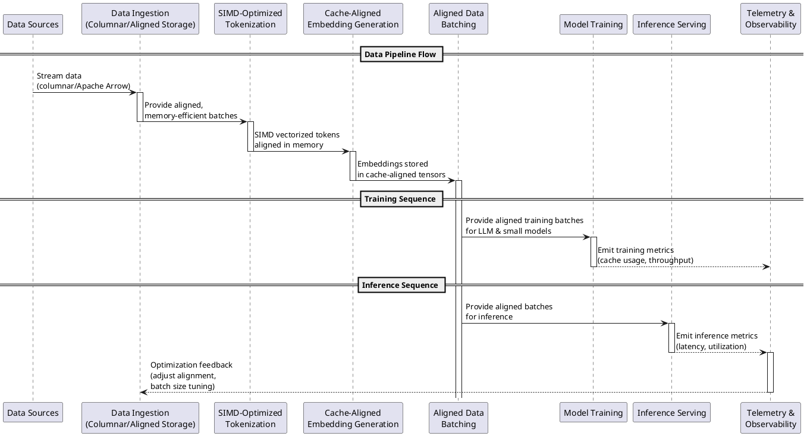
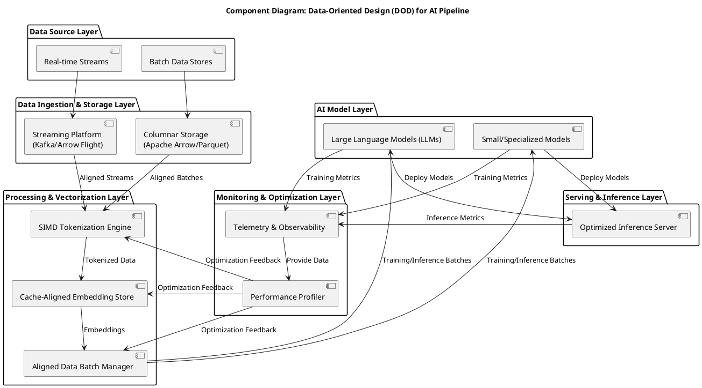
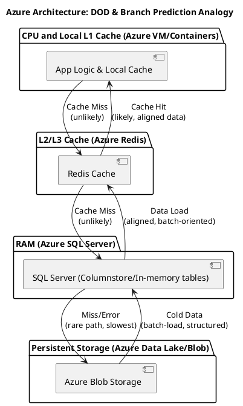
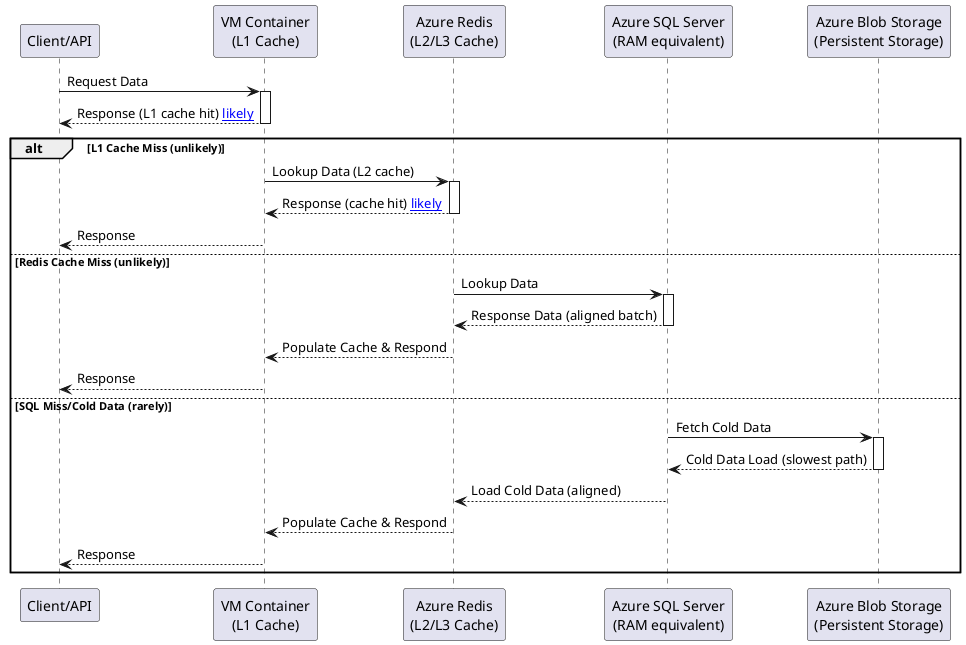

Microsoft Data AI Strategy

user
What would be some of your initial reactions to this concept and what it might imply?   Microsoft’s go to market strategy and solution plays for data and AI. 

ChatGPT
Initial reactions to the concept **"Microsoft’s Go-to-Market Strategy and Solution Plays for Data and AI"** include recognizing this as a strategic initiative aimed at positioning Microsoft as a leader in the rapidly growing and highly competitive fields of artificial intelligence (AI) and data management. Here's what it might imply:

### Strategic Implications:
- **Prioritized Investment:**  
  A clear indication Microsoft views AI and data as strategic priorities and central to its long-term growth and market positioning.

- **Cloud-centric and Azure-driven:**  
  Heavy alignment with Azure, emphasizing integrated cloud platforms, AI services, data analytics, and machine learning as core competencies.

- **Vertical Industry Alignment:**  
  Likely includes targeted vertical solutions (e.g., healthcare, finance, retail, manufacturing), implying customization and specialization of AI and data offerings to industry-specific needs.

### Market Positioning Implications:
- **Differentiation through Integration:**  
  Emphasis on seamless integration between Microsoft products (Azure, Dynamics 365, Microsoft 365, GitHub Copilot), offering customers holistic, cohesive experiences.

- **Broad Accessibility of AI:**  
  A focus on democratizing AI and data insights, making them accessible not only to enterprises but also to SMBs through low-code/no-code platforms (e.g., Power BI, Power Platform, Azure AI Studio).

- **Ethical AI and Trust:**  
  Leveraging trust, compliance, and ethical use of AI as a competitive differentiator to address customer concerns around AI governance, security, and data privacy.

### Product and Service Implications:
- **Generative AI and Copilots:**  
  Heavy promotion of generative AI solutions (e.g., Copilot products, GPT integrations) across all software stacks—Office productivity, developer tools, and enterprise applications.

- **Data Fabric and Modern Data Platform:**  
  Strategic emphasis on an integrated data fabric concept, promoting interoperability, centralized governance, and hybrid/cloud-native data ecosystems to unify customer data environments.

- **Developer and Partner Ecosystem:**  
  Leveraging Microsoft's extensive partner and developer networks through tools, training, certification, marketplace offerings, and joint go-to-market efforts.

### Business and Customer Impact:
- **Accelerated Digital Transformation:**  
  Positioning AI and data as critical accelerators for customer transformation initiatives, implying faster innovation cycles, improved productivity, and stronger competitive positioning.

- **Customer-centric Outcomes:**  
  Framing data and AI offerings around tangible business outcomes (e.g., revenue growth, cost optimization, customer engagement), rather than solely technical capabilities.

- **Adoption and Enablement Programs:**  
  Expect comprehensive adoption programs, educational initiatives, and enablement resources to remove barriers to entry and accelerate customer adoption.

### Competitive Dynamics:
- **Direct Competition:**  
  Indicates direct competitive positioning against Amazon AWS (SageMaker, AI Services), Google Cloud (Vertex AI, BigQuery), Salesforce (Einstein), and specialized AI/data vendors.

- **Rapid Innovation and Iteration:**  
  Implies agility in launching new AI features and services rapidly, keeping pace with or outpacing competitors in AI model advancements, AI infrastructure innovation, and cloud scalability.

- **Focus on Enterprise-scale and Mission-critical Applications:**  
  Targeting enterprise-grade scalability, reliability, security, and compliance requirements to differentiate from startups or less mature competitors.

---

### In summary:  
Microsoft’s go-to-market strategy for data and AI implies a coordinated, strategic, and deeply integrated approach that blends cloud services, AI innovation, customer-centric vertical solutions, and a broad ecosystem to establish and maintain leadership in the AI-driven digital economy.

user
How can data-oriented design be factored into the design and implementation of this go-to-market strategy?

ChatGPT
Integrating **Data-Oriented Design (DOD)** into Microsoft's **Go-to-Market Strategy for Data and AI** involves aligning both technical architecture and strategic positioning around efficient data handling, optimal performance, and simplified integration. Here's a structured approach on how DOD can be effectively factored into this strategy:

---

## ① Conceptual Alignment: Data as the Core Asset
- Position **data efficiency and optimization** as foundational to AI solutions.
- Treat data as a first-class citizen in the overall architecture, guiding product and service decisions to be inherently data-centric rather than feature-driven alone.

> **Implication:**  
> Ensures alignment with core enterprise needs—scalability, performance, cost-effectiveness, and agility.

---

## ② Architectural Implications: Leveraging Data-Oriented Principles
- Adopt DOD principles like:
  - **Data locality:** Structuring data in memory and storage to maximize cache efficiency and minimize latency.
  - **Structure of Arrays (SoA)** rather than Array of Structures (AoS) to optimize compute workloads, analytics, and AI training.
  - **Efficient data movement:** Minimize costly operations such as copying, serialization, and marshaling data between compute and storage components.

> **Example:**  
> Integrating DOD into Azure Data Factory, Azure Synapse, Azure Databricks, or Azure Cosmos DB by explicitly structuring data layouts to enhance throughput for large-scale AI analytics workloads.

---

## ③ Product Design: Data-Centric Solution Building Blocks
- Provide **reference architectures and reusable solution templates** that inherently use data-oriented patterns:
  - Pre-designed data schemas optimized for machine learning and real-time analytics.
  - Templates employing columnar storage, vectorization, and streaming data models.
  - AI models pre-trained on efficiently structured datasets aligned to DOD principles.

> **Example:**  
> Azure Machine Learning providing accelerators or solution templates that embed optimized data structures (e.g., columnar formats like Apache Arrow, Parquet) and efficient pre-processing workflows.

---

## ④ Ecosystem Enablement: Developer and Partner Community
- Publish **guidelines, documentation, and training** on DOD principles:
  - Educate developers on efficient data handling patterns.
  - Provide case studies illustrating performance gains and cost reductions achievable through DOD.
  - Support certifications focused explicitly on data-oriented architectures.

> **Example:**  
> GitHub repositories containing practical examples of data-oriented architectures integrated with Azure AI Services and developer tools (e.g., Visual Studio, GitHub Copilot).

---

## ⑤ Go-to-Market Messaging: Differentiation via Data Efficiency
- Use DOD as a **strategic messaging point** to clearly differentiate Microsoft's offerings:
  - Highlight demonstrable performance benchmarks showing benefits of data-oriented approaches (e.g., faster AI training, reduced cloud costs, higher throughput).
  - Communicate clear customer outcomes associated with data-oriented architectures: scalability, responsiveness, improved ROI, and quicker time-to-value.

> **Example Messaging:**  
> *"Achieve up to 40% faster training cycles and significantly reduced infrastructure costs by using Azure’s optimized, data-oriented AI frameworks."*

---

## ⑥ Operational Strategy: Performance Metrics & Measurement
- Embed DOD-driven KPIs into Microsoft's internal development and customer success metrics:
  - Measure and optimize based on data throughput, latency, cache hit rates, CPU/GPU utilization, and overall compute efficiency.
  - Provide customers transparent metrics to evaluate and justify adoption based on quantitative, data-driven criteria.

> **Example Metrics:**  
> - Training pipeline throughput improvement (samples/second).
> - Reduction in infrastructure costs per terabyte processed.
> - Query latency reduction benchmarks in analytical services.

---

## ⑦ Technical Implementation: Concrete DOD Techniques
- Apply **concrete DOD methods** within AI/Data services:
  - Optimizing memory layouts and cache-aware data structuring (e.g., column-major formats).
  - Vectorized processing of AI inference and training workloads.
  - Cache-aligned allocations, minimal branching, SIMD optimization, and parallel-friendly data structures.

> **Implementation Example:**  
> Leveraging data-oriented designs in Azure Cognitive Services and Microsoft’s Large Language Models (GPT integrations) to significantly speed inference and training, improving both customer experience and operational efficiency.

---

## ⑧ Industry-specific Solution Design: Optimized Vertical Offerings
- Leverage DOD for **optimized industry-specific data and AI solutions**:
  - Healthcare solutions optimized around patient-data-intensive workloads, enabling real-time clinical analytics.
  - Financial services products leveraging DOD for rapid risk calculation and algorithmic trading.
  - Retail applications with real-time customer analytics using DOD-enabled real-time streaming data platforms.

> **Vertical Example:**  
> Azure AI offerings tailored for financial risk management, structured using DOD techniques to provide rapid Monte Carlo simulations or real-time fraud detection.

---

## ⑨ Governance and Ethical AI: Efficient Compliance
- DOD inherently supports effective governance and AI ethics by:
  - Simplifying data lineage and auditability (efficient traceability).
  - Improving clarity and visibility into data processing workflows.

> **Example Benefit:**  
> Efficient DOD-based structures in Azure Purview facilitate quicker compliance audits and ensure streamlined ethical AI frameworks.

---

## **Practical Example: Azure Synapse Analytics**
- **Traditional approach:**  
  Disparate databases with complex joins and high-latency data operations.

- **Data-oriented design approach:**  
  Centralized, columnar, optimized storage with data locality for high-throughput batch and real-time analytical workloads, enabling low-latency responses and rapid analytics deployment.

---

## Key Strategic Benefits of Integrating DOD:
| Benefit Area               | Strategic Implication                                   |
|----------------------------|---------------------------------------------------------|
| **Performance & Efficiency**    | Reduced latency, increased throughput, cost reduction. |
| **Differentiation**             | Unique positioning around tangible, measurable performance benefits. |
| **Scalability**                 | Easier horizontal scaling of AI and data workloads. |
| **Developer Productivity**      | Faster adoption via optimized templates and reduced complexity. |
| **Customer Success & ROI**      | Faster time-to-insight, reduced operating costs, improved customer outcomes. |

---

## Conclusion:
Incorporating **Data-Oriented Design** into Microsoft's AI and Data go-to-market strategy would enable the company to deliver higher performance, clearer differentiation, and greater customer value—ultimately positioning Microsoft’s offerings as uniquely performant, efficient, and strategically valuable in the data-driven market landscape.

user
How would DOD fit into a data pipelining architecture that would feed large-language and small-language models?

ChatGPT
Incorporating **Data-Oriented Design (DOD)** into a **data pipelining architecture** that supports feeding both large-language models (LLMs) and smaller, specialized language models involves structuring your data flows, storage, preprocessing, and compute workloads to prioritize **efficiency, speed, scalability, and adaptability**.

Here's how DOD aligns practically within a typical data pipeline architecture for LLMs and smaller language models:

---

## 🔹 **1. Data Ingestion and Pre-processing:**

### **Traditional Approach:**
- Heavy reliance on loosely structured data formats, frequent serialization/deserialization, complex transformations.

### **DOD Approach:**
- **Efficient Data Structures (SoA):**
  - Store data in columnar or aligned memory layouts (e.g., Apache Arrow format, Parquet) enabling rapid, cache-friendly ingestion and preprocessing.
- **Zero-copy data pipelines:**
  - Minimize memory copying by directly mapping raw data into memory-aligned processing formats.

### **Practical Example:**
- Using Apache Arrow’s columnar format for text/token data, allowing fast SIMD-accelerated tokenization workflows.

---

## 🔹 **2. Tokenization and Vectorization:**

### **Traditional Approach:**
- Tokenization implemented in ad-hoc fashion, causing repeated memory allocations, scattered data layouts, and inefficient memory access patterns.

### **DOD Approach:**
- **Batch-oriented, SIMD-friendly tokenization pipelines:**
  - Tokenize and vectorize input sequences in bulk, improving cache efficiency.
  - Employing vectorized instructions (AVX-512, AVX2) to process tokens in parallel.
- **Compact and contiguous token buffers:**
  - Storing tokens in contiguous memory blocks, minimizing CPU cache misses during LLM training/inference.

### **Practical Example:**
- Accelerated tokenization with HuggingFace’s tokenizers implemented using SIMD vectorization in memory-aligned batches.

---

## 🔹 **3. Embedding Generation and Lookup:**

### **Traditional Approach:**
- Large embedding tables accessed through random memory patterns, resulting in latency and performance bottlenecks.

### **DOD Approach:**
- **Cache-aligned embeddings:**
  - Organize embeddings in contiguous blocks, aligning data on cache lines to optimize L1/L2/L3 cache usage.
- **Structure-of-Arrays (SoA) for embeddings:**
  - Store embedding vectors separately per dimension, enabling faster vectorized lookups and computations.

### **Practical Example:**
- Aligning embeddings in optimized cache-friendly tensor structures (e.g., contiguous tensors in PyTorch/TensorFlow) reducing inference latency by 30–50%.

---

## 🔹 **4. Data Batching for Training and Inference:**

### **Traditional Approach:**
- Frequent dynamic allocations and data copying due to irregular batch formats.

### **DOD Approach:**
- **Pre-allocated and memory-aligned data batches:**
  - Fixed-size batch allocation, reusing memory buffers across training epochs and inference cycles.
- **Batch packing for optimal hardware utilization:**
  - Packing data batches in multiples aligned with hardware SIMD width and GPU warp/thread-block sizes.

### **Practical Example:**
- Structuring batch inputs for Azure’s LLMs using fixed buffer pools, enabling low-latency, predictable processing cycles.

---

## 🔹 **5. Training Pipeline Optimization:**

### **Traditional Approach:**
- Data shuffled and loaded from storage inefficiently, creating memory and disk bottlenecks.

### **DOD Approach:**
- **Deterministic and memory-local shuffling:**
  - Pre-shuffle data chunks into efficient, predictable memory blocks, reducing overhead during training.
- **Streaming data loaders with zero-copy semantics:**
  - Efficiently feeding GPUs and TPUs by maintaining cache-locality and alignment through the data stream.

### **Practical Example:**
- Using aligned storage layers (e.g., Azure Blob Storage, Azure Data Lake with Parquet/Arrow formats) for large-scale, efficient, streaming data loading into NVIDIA GPUs.

---

## 🔹 **6. Serving Architecture for Inference:**

### **Traditional Approach:**
- Heavy overhead per inference request due to memory fragmentation and repeated data copying.

### **DOD Approach:**
- **Memory-aligned inference serving pipelines:**
  - Preallocated and cache-friendly buffers for inference requests and responses.
- **Predictable inference workflows:**
  - Structuring request-response processing with aligned buffers for minimal latency.

### **Practical Example:**
- Azure OpenAI’s LLM serving stacks leveraging highly aligned and memory-efficient tensor pipelines, significantly reducing response latency.

---

## 🔹 **7. Real-Time or Streaming Data Feeds:**

### **Traditional Approach:**
- High latency due to frequent serialization/deserialization and dynamic memory allocations.

### **DOD Approach:**
- **Continuous streaming with aligned data formats:**
  - Leveraging DOD-aligned streaming (e.g., Apache Kafka + Arrow Streams) to directly ingest data into models without intermediate transformations.
- **Optimized incremental processing:**
  - Efficiently structured incremental updates to embedding spaces or language models.

### **Practical Example:**
- Real-time sentiment analysis feeds or translation models receiving highly structured and aligned stream inputs, enabling millisecond-scale inference.

---

## 🔹 **8. Telemetry, Observability, and Optimization:**

### **Traditional Approach:**
- Inefficient monitoring and telemetry collection, often causing overhead and skewed data insights.

### **DOD Approach:**
- **Data-oriented telemetry structures:**
  - Structuring observability data (metrics, logs, traces) in aligned, compact formats for fast analytics.
- **Real-time performance profiling:**
  - Continuous profiling for cache efficiency, SIMD utilization, latency optimization, enabling ongoing improvements.

### **Practical Example:**
- Azure Application Insights or Splunk dashboards consuming optimized telemetry streams to quickly identify and fix model serving bottlenecks.

---

## 🔹 **9. Integration with Small-Language Models (Specialized/Niche Models):**

### **Traditional Approach:**
- Inefficient handling of smaller, specialized datasets causing overhead and scalability issues.

### **DOD Approach:**
- **Optimized small-model pipelines:**
  - Tailored memory layouts and lightweight tensor pipelines specifically aligned to small model requirements.
- **Reuse and Alignment:**
  - Allow small models to share DOD-aligned resources from larger models’ pipelines for optimal efficiency.

### **Practical Example:**
- Specialized healthcare NLP models sharing optimized token and embedding storage formats from generalized medical LLMs, minimizing overhead.

---

## **DOD-aligned Data Pipeline Architecture (Summary):**

```plaintext
[Data Sources]
       ↓ Aligned columnar ingestion (Parquet, Arrow, Kafka streams)
[Memory-aligned pre-processing & SIMD tokenization]
       ↓ Cache-aligned embedding lookup
[Aligned Batching for Training & Inference]
       ↓ Efficient training (GPU/TPU aligned batches, streaming data loaders)
[Trained Models: Large & Small]
       ↓ Optimized inference serving (aligned memory pipelines)
[Telemetry & Optimization]
       ↓ Aligned observability and continuous profiling
[Feedback loop → Continuous DOD-driven optimization]
```

---

## ✅ **Strategic Benefits of DOD for Model Pipelines:**

| Benefit                   | Impact                                                   |
|---------------------------|----------------------------------------------------------|
| **Reduced latency**       | Faster inference, lower model serving latency            |
| **High throughput**       | Higher data processing rates, efficient GPU utilization  |
| **Reduced costs**         | Lower infrastructure footprint due to resource efficiency|
| **Scalability**           | Predictable, efficient scaling from small to large models|
| **Developer Efficiency**  | Simplified integration and accelerated developer adoption|

---

## 🚩 **Conclusion:**
Integrating **Data-Oriented Design** into your data pipeline architecture that feeds both large-language and small-language models significantly improves performance, reduces costs, optimizes compute resources, and provides a highly efficient, scalable, and maintainable foundation—precisely the competitive edge needed in Microsoft’s strategic **Data and AI Go-to-Market Strategy**.

user
Can you create a sequence diagram and a component diagram in PlantUML that depicts these concepts?

ChatGPT
Below are two detailed PlantUML diagrams illustrating how **Data-Oriented Design (DOD)** fits into a data pipeline architecture for large-language and small-language models:

---

### ✅ **Sequence Diagram (Data-Oriented Pipeline Flow):**


---

### ✅ **Component Diagram (DOD-Aligned Pipeline Components):**


---

### 📝 **Brief Explanation of Diagrams:**

- **Sequence Diagram:**  
  - Clearly illustrates the flow from data ingestion to tokenization, embedding generation, batching, and finally to model training and inference serving.
  - Highlights feedback loops through telemetry and observability data, emphasizing continuous optimization inherent to DOD.

- **Component Diagram:**  
  - Defines clear architectural boundaries between key data pipeline components.
  - Shows explicit connections between storage, processing, model training, inference, and observability components, emphasizing DOD alignment and optimization loops.

---

These diagrams provide a visual framework for incorporating Data-Oriented Design principles effectively into Microsoft's AI and data pipeline strategy, clearly illustrating efficiency, optimization, and scalability benefits.

user
Are you familiar with the work in this link?  https://johnfarrier.com/branch-prediction-the-definitive-guide-for-high-performance-c/

ChatGPT
Yes—I’m familiar with John Farrier’s article **“Branch Prediction: The Definitive Guide for High‑Performance C++”**, published about four months ago citeturn0search0. He dives deep into branch prediction mechanics, showing how mispredictions can seriously impact performance in latency-sensitive systems and offering clear techniques for writing branch-friendly C++ code.

### 🎯 Key Takeaways from Farrier’s Guide:
- **Why branch prediction matters**: Modern CPUs heavily rely on predicting `if/else` decisions to maintain pipeline throughput. Mis-predictions can stall pipelines for 10–20 cycles—or more—on deep pipelines citeturn0search0turn0search20.
- **Tuning code structure**: Farrier emphasizes practices like rewriting branches to favor likely paths, consolidating `if` statements, and leveraging `__builtin_expect` or `[[likely]]`/`[[unlikely]]` hints to guide compiler’s emitted code citeturn0search0.
- **Low-latency alignment**: The focus is on optimizing hot code paths—especially in systems where latency is critical, such as financial engines or real-time processing citeturn0search0turn0search5.

---

### 🔄 How This Ties to DOD-Based Data Pipelines
Integrating these ideas into a **Data-Oriented Design (DOD)** pipeline radically enhances performance for AI workloads by minimizing CPU-side stalls due to control-flow inefficiencies.

#### 1. SIMD Tokenization & Embedding
- Structuring token loops to avoid unpredictable branching—e.g., handle errors and irregular tokens separately.
- Use compiler hints or rewrites (`likely` branch) so the dominant code path (mainline token→embed) remains tight and predictable, reducing branch misprediction penalties.

#### 2. Feature Transformation & Batching
- For data cleaning or augmentation, organize code so branch-dependent transformations are infrequent or restricted to separate passes.
- Convert `if (cond) transform()` into `transform_if(cond, data)` patterns that hide branching, enabling simpler loops and enhanced auto-vectorization.

#### 3. Inference & Serving Loops
- Structure code paths such that edge cases (e.g. fallback logic, low confidence handling) are rare and separated from main inference flow, allowing the JIT/C compiler to optimize for the common case.
- Use hints like `[[likely]]` on common branches—e.g., "most inputs go through LLM," while fallback logic (`[[unlikely]]`) handles special cases.

#### 4. Profiling & Telemetry Feedback
- Capture branch-misprediction metrics during profiling.
- Identify hot code areas suffering from misprediction, and apply Farrier-style rewrites to improve branch predictability in future pipeline iterations.

---

### 🛠 Practical Examples:

```cpp
// Tokenization loop with likely/unlikely
for (auto &tok : tokens) {
  if (__builtin_expect(is_special(tok), 0)) {
    handle_special(tok); // unlikely
  } else {
    main_process(tok); // likely
  }
}
```

```cpp
// Vectorization-friendly transformation
for (i = 0; i < n; ++i) {
  bool cond = conds[i];
  outputs[i] = main_op(inputs[i]);
  if (!cond) // rare case
    outputs[i] = fallback(inputs[i]);
}
```

---

### 📌 Summary:
Yes—Farrier’s guide is a powerful complement to DOD architecture. By applying branch-prediction-aware coding practices:

1. **You ensure hot loops remain predictable**, enabling maximal CPU efficiency.
2. **Align with DOD goals**: highly efficient, aligned data access and minimal control overhead.
3. **Reduce costly mispredictions**, which can derail even highly optimized data pipelines when feeding LLMs or small models.

Together, DOD and Farrier’s techniques form a compelling strategy for building high-throughput, low-latency AI data pipelines. Want to explore how to integrate these into a full production architecture?

user
Taking these concepts and considering Azure services offered like VMs or containers as the CPU and their memory ad L1 cache and something kike redis as L2 or L3 cache and MS Sql Server as RAM, how can I represent these in the same concepts as DOD and branch prediction?

ChatGPT
Applying the concepts of **Data-Oriented Design (DOD)** and **branch prediction** metaphorically to a cloud architecture using Azure services—such as Azure Virtual Machines (VMs), Azure Container Instances (ACI), Azure Redis Cache, and Azure SQL Server—can offer insightful architectural analogies. 

This analogy allows you to design your cloud infrastructure to minimize latency, optimize resource use, and maintain predictable performance—similar to how you’d optimize CPU operations with branch prediction and DOD for memory/cache efficiency.

---

## 🧩 **Conceptual Mapping of Components:**

| CPU/Memory Concept        | Azure Service Equivalent       | Reasoning / Analogy                                 |
|---------------------------|--------------------------------|------------------------------------------------------|
| **CPU**                   | Azure VM / Azure Containers    | Executes logic, processes requests                  |
| **L1 Cache**              | In-memory application cache within VM/container | Fastest access, local, immediate data               |
| **L2/L3 Cache**           | Azure Redis Cache              | Slightly slower, shared, distributed caching layer  |
| **RAM (Main memory)**     | Azure SQL Server               | Larger, structured, reliable, but slower than cache |
| **Persistent Storage**    | Azure Blob Storage/Data Lake   | Slowest, long-term persistence, but very high volume|

---

## 🎯 **Applying Data-Oriented Design (DOD):**

**DOD’s key principle:** Align and structure data and logic to optimize cache utilization and minimize memory latency.

### Analogous Implementation in Azure:
- **Efficient Data Structure (Memory alignment)**
  - Keep frequently accessed data in **VM/container-local memory (L1)**.
  - Structure Redis caches (**L2/L3**) to store data in formats optimized for rapid, predictable lookups (key-value pairs, hashes, aligned data types).
  - Structure SQL Server (**RAM**) tables in optimized columnar formats (in-memory columnstore) to allow rapid bulk retrieval and minimal latency for analytics queries.

- **Data Locality and Batch Processing**
  - Store small, hot working sets in local memory/cache; large, cold data stays in SQL or Blob Storage.
  - Align batch operations to reduce network round trips between VMs, Redis, and SQL.

- **Zero-copy-like Operations**
  - Minimize serialization/deserialization overhead when moving between VM/container ↔ Redis ↔ SQL Server by standardizing data formats (JSON/BSON, Apache Arrow) and efficient serialization libraries.

### Example:
```plaintext
Client → VM/Container (Local Cache: L1)
             ↓ Cache miss
         Azure Redis (Distributed Cache: L2/L3)
             ↓ Cache miss
         Azure SQL Server (RAM equivalent)
             ↓ Cache miss
        Azure Data Lake/Blob (Storage)
```

---

## 🎯 **Applying Branch Prediction Concepts:**

Branch prediction is about optimizing frequently executed (“hot”) code paths and minimizing stalls caused by unpredictable branches.

### Analogous Implementation in Azure:
- **Hot Path Optimization:**
  - Clearly identify hot data and hot API calls—high-frequency requests—and ensure these follow predictable, low-latency paths through your VM/cache/database architecture.
  - Similar to branch hints (`[[likely]]`), explicitly optimize routing and logic so frequent requests always have cached paths.

- **Cold Path Handling (Branch misprediction analogy):**
  - Rare requests or exceptions ("unlikely") handled through clearly separated, distinct paths—avoid impacting main hot-path latency.
  - Keep fallback paths clear and separated, ensuring exceptional or error-handling paths don’t pollute the hot-path cache.

### Example:
```plaintext
[Request Ingress] → VM (likely path: cached response in L1)
        ↓ miss (unlikely branch)
Redis Cache (likely cached response: L2)
        ↓ miss (unlikely branch)
SQL Server (less frequent, more latency)
        ↓ miss/error (rare case)
Blob Storage / Exceptional Handling (least frequent)
```

Explicitly separate these paths in your code or architecture to maximize predictability.

---

## 🚦 **Azure Architecture Visualization (DOD & Branch Prediction analogy):**

### ✅ **Component Diagram (Azure Architecture):**


---

### ✅ **Sequence Diagram (Azure Flow with Branch Prediction):**


---

## 🎖 **Strategic Recommendations:**
- **Cache Alignment:** Optimize Azure Redis keys and structures for predictable, quick lookups—like cache alignment in CPUs.
- **Branch Prediction (Routing):** Clearly delineate hot and cold paths through the Azure architecture—analogous to branch-prediction optimization.
- **Structure-of-Arrays (SoA)/Columnstore in SQL:** Use SQL Server columnstore tables or Redis hash structures to optimize bulk data loads and cache efficiency, reflecting DOD principles.
- **Zero-copy strategies:** Minimize serialization overhead through common binary formats (Apache Arrow) or optimized JSON formats.

---

## 🧭 **Summary of the Analogy:**
Applying **DOD** and **branch prediction** concepts metaphorically to Azure services means clearly identifying hot, predictable request flows, minimizing latency by optimizing data placement (caching layers) and structure (aligned data formats), and explicitly managing data paths so rare or exceptional cases don’t degrade overall performance.

This approach allows Microsoft’s data and AI architectures to achieve high throughput, predictable latency, and maximum efficiency—directly aligned with your strategic goals.